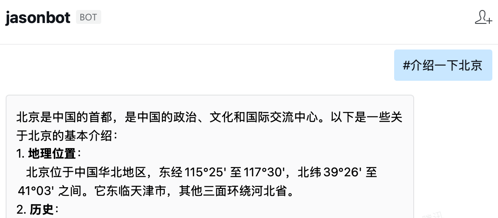
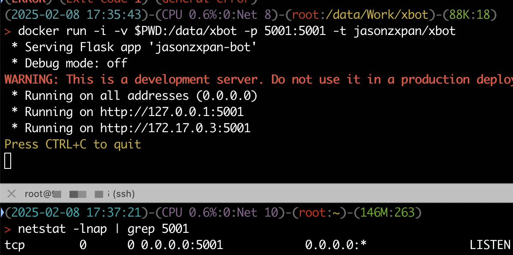

`xbot`是一个基于企业微信的机器人封装的**命令消息处理框架** ，用于通过企业微信接收用户的指令，**触发任务，或查询信息**。

**目的就是为了减轻个人的重复工作负担，提高工作效率。**

本项目可以看作[wecom_bot_svr](https://github.com/easy-wx/wecom-bot-svr)的应用，封装的功能和特点包括：

- 规范的对话格式，方便扩展。调用格式：``[scene] [cmd] [args]``
- 支持特殊字符开头的指令，用于特殊处理。如``#介绍一下北京``
- 支持权限控制，可以按照 scene + \[cmd\] + 日期的方式，对用户进行授权
- 支持返回文本、图片、文件等多种消息类型
- 通过结合异步主动发送消息，解决了即时推送需要5秒内返回的问题

尽管目前只实现了企业微信的应用，但是设计上兼容各种即时办公软件：除了 wecom_app.py 文件之外，其他的代码文件均不涉及特定的IM平台。

## 1. 使用方法

这是一个简单的框架，你自己用ChatGPT可能半天也能搞出来。不过如果这些代码可以满足你的需求，你也可以拿去直接用。

### 1.1 用法

1. fork 本项目
2. 修改 `config.py` 文件，填入企业微信的相关信息
    - 场景模块文件所在目录：``scene_dirs``
    - 特殊对话的前缀以及处理函数：``special_line_prefix``
    - 企业微信相关信息
3. 在 `services` 等 `scene_dirs` 指定的目录下添加你的服务模块代码
4. 修改local.db，添加特殊的权限控制，**将你的企业微信ID添加到数据库中**
5. 运行 `PYTHONPATH=.. python -m xbot.wecom_app` 启动服务

以上需要部署到服务器上，然后在企业微信后台配置回调地址，具体的部署和配置方式看这里：
《[企业微信机器人回调服务](https://github.com/easy-wx/wecom-bot-svr?tab=readme-ov-file#%E4%BC%81%E4%B8%9A%E5%BE%AE%E4%BF%A1%E6%9C%BA%E5%99%A8%E4%BA%BA%E5%9B%9E%E8%B0%83%E6%9C%8D%E5%8A%A1)》

### 1.2 测试指令

作为基础项目，这里有提供一些测试指令，可以用来测试是否能够正常运行。

- ``help``，列出所有的命令
- ``chat_id``，返回对话的 chat_id
- ``act_demo setup arg1 arg2``，这个是活动的接口，调用 activities 目录下的模块
- ``pub_demo setup arg1 arg2``，这个是公共的接口，调用 public 目录下的模块
- ``#介绍一下北京``，这个是特殊指令，用来测试特殊指令的处理，未实现，但是有返回提示

## 2. 设计

本地提供一个HTTP服务，用于接收企业微信(或其他IM工具)的消息推送。

### 2.1 通用对话格式

对话遵循以下格式：

``[scene] [cmd] [args]``

其中，`scene` 是场景，`cmd` 是命令，`args` 是参数。

每个 ``scene`` 对应一个 Python 模块；而在模块中，cmd的处理函数命名为 ``cmd_`` + cmd。这样带来了方便：可以动态的添加命令。

为了更清晰地组织代码，你可以将不同的场景放在多个目录中，只要你在 `__init__.py` 文件中，将对应目录追加到 scene_dirs 即可。

框架会按照目录顺序进行搜索，如果有模块名冲突，优先使用排列靠前的模块。
比如，项目的初始创建了 services 和 activities 两个目录，用来存放不同服务和活动级别的场景模块。

有一个特殊的目录——``public``，用来存放不敏感的公用接口。

``common`` 目录则用来存放公共的函数和类。

### 2.2 内部对话格式

有些特殊情况，可能不遵循通用对话格式，比如可以将某些对话接入大语言模型，我们可以使用 `#` 开头让服务知道，需要处理这种特殊服务。



因为是需要指定处理模块，也可以放到别的目录中。
建议放到 spec_line_proc_funcs 中，比如示例中的 `#`，
处理模块在 [spec_line_proc_funcs/hash_proc.py](spec_line_proc_funcs/hash_proc.py) 中。

### 2.3 对话服务适配与消息处理的分离

设计上，独立消息处理和服务处理：消息处理负责解析消息，服务处理负责处理业务逻辑。

这样，可以快速的构建企业微信之外、别的即时通信工具对话的服务。

### 2.4 权限管理

因为企业微信能够获得用户ID，所以通过 scene + cmd + 日期的方式，对用户进行授权。

本地有 ``db.sqlite3``文件进行管理。TODO 提供个通过何种方式同步？

只有授权用户才能进行对话，否则提示错误。

### 2.5 HELP 指令

待实现自动列举

- ``help``，列出所有的命令。
- ``help [scene]``，列出该场景下所有命令字。
- ``help [scene] [cmd]``，列出指定命令的详细帮助信息。

## 3. Docker 部署

不使用流水线，直接推送Docker镜像，注意将仓库设置为私有。

本仓库中提供的Dockerfile可以用于构建基础镜像，提供一个可以运行的环境。

### 3.1 构建

```bash
docker build --network="host" -t jasonzxpan/xbot .
```

如果在当前目录运行，可以直接将目录映射到 /data/xbot：

```bash
docker run -i -v $PWD:/data/xbot -p 5001:5001 -t jasonzxpan/xbot
```



## 4. 真实场景举例

### 4.1 统计一些信息

